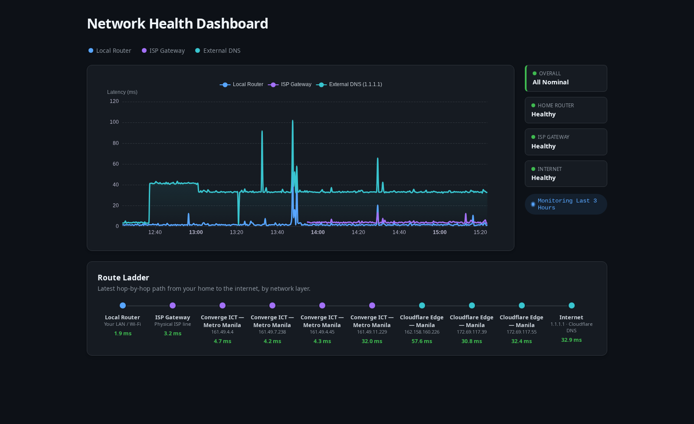

# ISP Health Dashboard

A local-first, lightweight time-series data collection and visualization system to monitor network health. It programmatically differentiates between Local Area Network (LAN) bottlenecks, ISP gateway failures, and wider internet backbone outages through continuous background ICMP polling.

📖 **[Read the Full System Architecture Explainer](ARCHITECTURE.md)**



## Features
- **Cross-Platform Backend:** Runs silently via native `subprocess` pings on macOS (`launchd`) and Linux (`systemd`).
- **Dynamic Network Auto-Detection:** Automatically discovers your active Local Router and ISP Gateway using intelligent `netstat` and `traceroute` parsing—no hardcoding required. Move seamlessly between home, office, and coffee shop networks. 
- **ICMP-Bypass (TCP Fallback):** Intelligently detects networks that aggressively block `ping` commands and dynamically fails over to raw TCP Socket connections (Port 53/80) to accurately measure gateway latency without triggering false offline alerts.
- **Route Ladder:** A landscape home→internet hop path beneath the chart, one rung per network layer (LAN / ISP / external), each colored by tier and showing live per-hop latency. Surfaces *which layer* a slowdown sits in — including the private Local Router and ISP Gateway hops. Fed by a periodic full-path traceroute captured into a `traceroute_hops` table.
- **At-a-Glance Status Rail:** A compact rail beside the chart shows Overall plus per-layer health (Home Router / ISP Gateway / Internet) as green/yellow/red tiles, so you get the verdict without interpreting the chart. Failures also draw a red "Offline" reference line at the packet-loss sentinel. Chart series use a neutral blue/purple/teal palette so line color denotes *which* target, never health.
- **Home Network Deployment:** Accessible to any browser on the LAN. 
- **PWA Ready:** Install the dashboard directly to any iOS/Android home screen.
- **Native OS Alerts:** Fires `osascript` (macOS) or `notify-send` (Linux) desktop alerts during critical congestion or outages, with a debounced critical-outage guard.

## Project Structure

This project is separated into a `backend` daemon and a `frontend` dashboard.

* `backend/` - A Python script utilizing `sqlite3` and `subprocess.run` to execute and record pings every 30 seconds. Managed by `uv`.
* `frontend/` - An SSR Astro web PWA visualizing the SQLite data using Apache ECharts.

## Setup & Running

### 1. The Prober (Backend)

The backend daemon inherently monitors three distinct targets to isolate bottlenecks:
1. **Local Router (`Auto-detected`)**: The first hop (your Wi-Fi or LAN gateway).
2. **ISP Gateway (`Auto-detected`)**: The first public IP (bypassing local Double NAT).
3. **External DNS (`1.1.1.1`)**: Cloudflare's edge servers.

**Interactive Run:**
```bash
cd backend
uv run prober.py
```

### Quick Start (macOS & Linux)
We provide a universal helper script that automatically detects your OS, unzombies processes, restarts the Python background service, statically spawns the Astro UI server using `nohup`, and outputs your live Dashboard URLs to connect.

```bash
./reload-daemon.sh
```
*(If you travel between networks, simply re-run this script to automatically detect and bind to the new routers).*

You can still manage the background services manually if you prefer:

**1. The Prober (Backend)**
* macOS: `launchctl load -w backend/com.user.isphealth.plist`
* Linux: `systemctl --user enable --now isp-health.service`
* Interactive: `cd backend && uv run prober.py`

**2. The Dashboard (Frontend)**
* Interactive: `cd frontend && npm install && npm run dev -- --host`

## Database

Data is logged locally to `backend/network_metrics.db` (WAL mode).

`network_metrics` — per-cycle latency samples:
* `id` (INTEGER PRIMARY KEY)
* `timestamp` (DATETIME, indexed)
* `target_node` (TEXT)
* `latency_ms` (REAL) — `-1.0` = failure sentinel

`traceroute_hops` — periodic full-path capture (every ~5 min) for the Route Ladder:
* `id` (INTEGER PRIMARY KEY)
* `timestamp` (DATETIME, indexed) — rows sharing a timestamp form one capture
* `hop_index` (INTEGER)
* `hop_ip` (TEXT) — public hops only (private/CGNAT excluded)
* `latency_ms` (REAL)

## Future Improvements

* Data retention: rows older than 30 days are pruned automatically by the prober on an hourly cadence.
* The database runs in WAL mode for concurrent reader/writer access between the prober and the dashboard.
