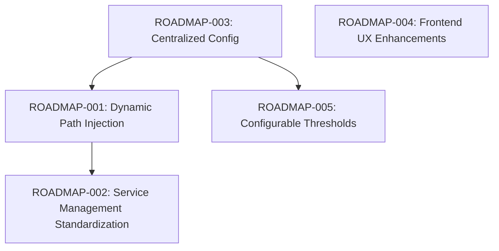

# ISP Health Dashboard Roadmap

This document tracks planned improvements and optimizations for the ISP Health Dashboard, focusing on cross-platform robustness, usability, and advanced monitoring features.

## Dependency Map

---

## Actionable Tickets

### [ROADMAP-001] Dynamic Path Injection for Service Files
**Priority:** High  
**Status:** Backlog  
**Description:** Replace hardcoded absolute paths in `com.user.isphealth.plist` and `.service` files with placeholders that are dynamically injected by `reload-daemon.sh` during setup.  
**Tasks:**
- [ ] Refactor `reload-daemon.sh` to use `sed` to update paths in template service files based on `$(pwd)`.
- [ ] Remove hardcoded paths from source control templates.

### [ROADMAP-002] Standardize Linux Service Architecture
**Priority:** Medium  
**Status:** Backlog  
**Description:** Align `CLAUDE.md` and `reload-daemon.sh` on whether to use `systemd --user` (no root required) or system-wide services.  
**Tasks:**
- [ ] Decide on User vs System service (User is recommended for local probers).
- [ ] Update `reload-daemon.sh` to support non-sudo service installation on Linux.
- [ ] Update documentation to reflect the chosen standard.

### [ROADMAP-003] Centralized Configuration Management
**Priority:** Medium  
**Status:** Backlog  
**Description:** Create a shared configuration mechanism (e.g., a `.env` file or a small JSON config) that both the Python backend and Astro frontend can read to determine the Database path.  
**Tasks:**
- [ ] Implement a common config reader in `prober.py`.
- [ ] Update `index.astro` to consume the same config.
- [ ] Add `.env.example` to the repository.

### [ROADMAP-004] Frontend UX & Data Visualization Polish
**Priority:** Low  
**Status:** Backlog  
**Description:** Enhance the dashboard with user-requested visual features and better data handling.  
**Tasks:**
- [ ] Add a "History Window" selector (e.g., 1h, 3h, 12h, 24h) instead of hardcoded 3 hours.
- [ ] Implement a Light/Dark mode toggle (currently hard-coded to dark).
- [ ] Optimize ECharts mobile responsiveness for smaller screens.

### [ROADMAP-005] Advanced Anomaly Threshold Tuning
**Priority:** Medium  
**Status:** Backlog  
**Description:** Allow users to tune the anomaly detection parameters (currently fixed at >50ms and 2x moving average) without editing the Python source code.  
**Tasks:**
- [ ] Move threshold constants to the centralized config (`ROADMAP-003`).
- [ ] Add logic to `prober.py` to reload config changes without a full restart if possible.
